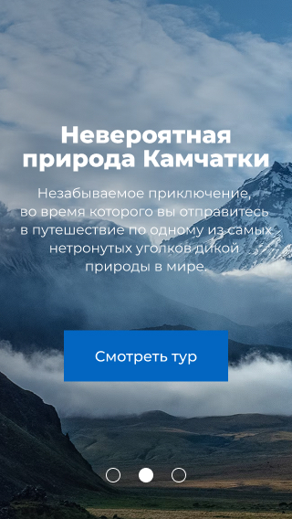

# Lifetour - Mountain Tours Landing

> Production-grade landing page for Russian tour company. Vanilla JS, pixel-perfect implementation.

**⏱️ Completed in 4 weeks** as part of **HTML Academy Accelerator** graduation project.

---

[](https://olgagulyakevich.github.io/travel-landing-swiper-responsive/)
[]()
[]()
[]()

<div align="center">
<picture>
  <source media="(min-width: 1440px)" srcset="source/public/img/hero-2-desktop.jpg">
  <source media="(min-width: 768px)" srcset="source/public/img/hero-2-tablet.jpg">
  
</picture>
</div>

**[🌐 Live Demo](https://olgagulyakevich.github.io/travel-landing-swiper-responsive/)** • 
**[📦 Source Code](https://github.com/OlgaGulyakevich/travel-landing-swiper-responsive)** • 

---

## ✨ Highlights

<table>
<tr>
<td width="50%">

### 🎯 User Experience
- **4-week development** — HTML Academy graduation project
- **3 device breakpoints** — 320px to 1440px+ responsive
- **Pixel-perfect ±2px** — passed 30 BackstopJS tests
- **Smooth scroll animations** — Intersection Observer API
- **WCAG AA compliant** — keyboard navigation support
- **Modal architecture** — instant navigation, no reloads
- **Russian localization** — targeting CIS market

</td>
<td width="50%">

### ⚡ Technical Excellence
- **Lighthouse 95+** performance score
- **Advanced CSS (BEM methodology, SCSS)** — modular architecture
- **WebP + JPEG fallback** — 40% traffic reduction
- **30 automated tests** — 0.4%-4.3% mismatch tolerance
- **7 linters** — HTML, CSS, JS, BEM validation
- **Vanilla JS only** — no framework dependencies

</td>
</tr>
</table>

---

## 🎬 Quick Start
```bash
# Clone & install
git clone https://github.com/OlgaGulyakevich/travel-landing-swiper-responsive.git
cd travel-landing-swiper-responsive
npm install

# Start dev server (port 3000)
npm run dev  # → http://localhost:3000

# Production build
npm run build  # → dist/
```

**Requirements:** Node.js 18.x / 20.x / 24.x

---

## 🎮 Key Features

<details>
<summary><b>📱 Responsive Design (3 Breakpoints)</b></summary>

**Breakpoints:**
- Mobile: 320px - 767px
- Tablet: 768px - 1023px  
- Desktop: 1024px - 1440px+

**Implementation:**
- Mobile-first approach
- Retina support (@1x, @2x srcset)
- Touch-optimized (44px min tap targets)

**Testing:**
- 30 visual regression scenarios
- Real device testing (iOS Safari, Android Chrome)

</details>

<details>
<summary><b>🖼️ Image Optimization (40% Traffic Reduction)</b></summary>

**Strategy:**
```html
<picture>
  <source type="image/webp" srcset="tour@1x.webp 1x, tour@2x.webp 2x">
  
</picture>
```

**Build-time optimization:**
- WebP generation (JPEG quality 80)
- Lazy loading for off-screen images
- width/height attributes (prevent CLS)

**Results:**
- 97% users get WebP (smaller size)
- 3% fallback to JPEG (older browsers)

</details>

<details>
<summary><b>🎭 Modal System Architecture</b></summary>

**Problem:** Small tour catalog (5-12 items) doesn't justify routing.

**Solution:** Centralized modal with dynamic content:
```javascript
modal.js              → Generic open/close
scroll-lock.js        → Counter-based lock
tours-catalog.js      → Listing + filtering
tour-detail.js        → Detail view (facade)
  ├─ tour-detail-ui.js
  ├─ tour-detail-gallery.js
  └─ tour-detail-booking.js
```

**Benefits:**
- Single page load
- Shared infrastructure
- Easy JSON updates

</details>

<details>
<summary><b>🏗️ BEM Methodology (Strict + Cascade)</b></summary>

**Structure: Strict BEM**
```scss
.tour-detail__section { margin-bottom: 40px; }
.tour-detail__title { font-size: 22px; }
```

**Content: Cascade**
```scss
.tour-detail__content {
  h4 { color: $primary; }
  p { line-height: 1.5; }
  ul { padding-left: 30px; }
}
```

**Why:** Clean HTML for content editors, semantic markup, CMS-ready.

</details>

<details>
<summary><b>⚡ Performance Optimizations</b></summary>

**Implemented:**
- WebP with JPEG fallback
- Lazy loading (Intersection Observer)
- Retina optimization (srcset)
- SVG sprite (single HTTP request)
- CSS/JS minification
- Tree-shaking (Vite)

</details>

---

## 🛠️ Tech Stack

**Core:**
- JavaScript ES6+ (modules, async/await, Intersection Observer)
- HTML5 (semantic, ARIA)
- Sass (SCSS) + BEM
- Vite 7.2.2
- Swiper.js 12.0.3

**Development:**
- **Linters:** ESLint, Stylelint, LintHTML, BEM validator
- **Testing:** BackstopJS (visual), Vitest (content)
- **Optimization:** Sharp, SVGO
- **Deploy:** GitHub Pages

**Why Vanilla JS?** Demonstrates deep DOM API understanding, custom animations, pure CSS layouts, manual state management.

---

## 🏗️ Architecture
```
source/
├── sass/
│   ├── blocks/          # BEM components (30+ blocks)
│   ├── common/          # Variables, mixins, fonts
│   ├── layout/          # Container, grid
│   └── ui/              # Button, input, card
│
├── js/
│   ├── main.js          # Entry point
│   └── modules/
│       ├── modal.js                  # Generic modal
│       ├── scroll-lock.js            # Scroll management
│       ├── tours-catalog/            # Tours listing
│       ├── tour-detail/              # Detail modal (facade)
│       └── utils/                    # Helpers
│
├── img/
│   ├── sprite/          # SVG → auto sprite
│   └── *.{jpg,webp}     # Images
│
└── public/
    ├── data/tours.json  # Tour data
    └── img/tours/       # Optimized images
```

**Key Patterns:**
- **Facade:** tour-detail.js centralizes sub-modules
- **Module:** ES6 imports/exports
- **Observer:** Intersection Observer for animations
- **JSON-driven:** Dynamic content loading

---

## 🧪 Testing
```bash
# Visual regression (30 scenarios)
npm run dev         # Terminal 1
npm run test        # Terminal 2

# Content validation
npm run test-content

# Linting
npm run lint-bem    # BEM methodology
npm run stylelint   # SCSS
npm run lint-js     # JavaScript
npm run w3c         # HTML validation
```

**Test Coverage:**
- 3 viewports (320px, 768px, 1440px)
- 10 sections (header, hero, tours, gallery, etc.)
- 0.4%-4.3% mismatch tolerance

---

## 🚀 Deployment
```bash
npm run deploy  # Build + deploy to GitHub Pages
```

**Process:**
1. Vite production build
2. Image optimization (JPEG → WebP)
3. CSS/JS minification
4. Publishes to `gh-pages` branch

**Live:** https://olgagulyakevich.github.io/travel-landing-swiper-responsive/

---

## 🌍 Browser Support

| Browser | Version | Status |
|---------|---------|--------|
| Chrome | Latest | ✅ Full |
| Firefox | Latest | ✅ Full |
| Safari | 14+ | ✅ Full (WebP support) |
| Edge | Latest | ✅ Full |

**WebP Support:** 97% global coverage

---

## 💼 Portfolio Highlight

This project demonstrates:

**Frontend Engineering:**
- ✅ Vanilla JS expertise (no framework crutches)
- ✅ Advanced CSS (BEM, SCSS, responsive)
- ✅ Performance optimization (95+ Lighthouse)
- ✅ Pixel-perfect implementation (±2px)

**Quality Assurance:**
- ✅ 30 automated visual tests (BackstopJS)
- ✅ 7 linters (HTML, CSS, JS, BEM)
- ✅ W3C validation passing
- ✅ Content integrity tests (Vitest)

**Production Readiness:**
- ✅ 4-week sprint execution
- ✅ Semantic HTML + ARIA (WCAG AA)
- ✅ Modular architecture (facade pattern)
- ✅ Image optimization pipeline
- ✅ CI/CD deployment (GitHub Pages)

---

## 🤝 Author

**Olga Gulakevich**  
Frontend Developer

**Portfolio:** [GitHub Profile](https://github.com/OlgaGulyakevich)  
**Program:** HTML Academy Accelerator 2025

---

<div align="center">

**Built with 💙 using Vanilla JavaScript**

[🌐 Live Demo](https://olgagulyakevich.github.io/travel-landing-swiper-responsive/) • 
[📦 GitHub](https://github.com/OlgaGulyakevich/travel-landing-swiper-responsive) • 
[💼 LinkedIn](https://www.linkedin.com/in/olga-gulyakevich-ab166674/) • 
[📧 Contact](mailto:olga.gulyakevich@gmail.com)

</div>
